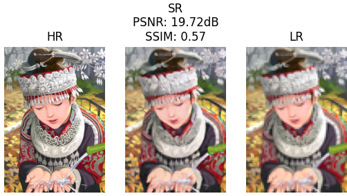
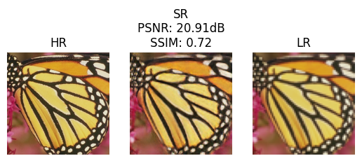
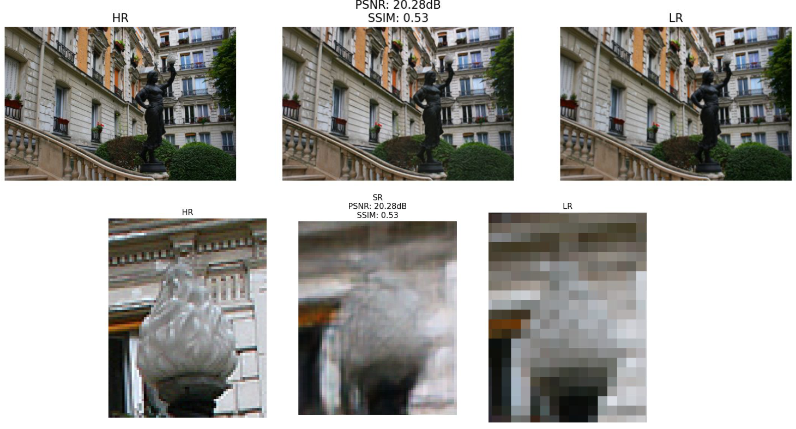

# **Enhance image resolution using a Generative Adversarial Network**
* **Team member**
    * [Dinh Hoang Lam](https://github.com/LamKser)
    * [Tran Duy Ngoc Bao](https://github.com/TranDuyNgocBao)
    * [Tran Nguyen Phuc Vinh](https://github.com/Lasky0908)
* Our report: [PDF](https://drive.google.com/file/d/1E4LMsEhZwS747aOu_rLXSmuXMrnNJH_h/view?usp=sharing)
* Web demo with Flask:  
   * Download source code [**Web-app**](https://github.com/LamKser/image-super-resolution-web-app) and run `app.py`
## **SRGAN architecture**
Original paper: [Photo-Realistic Single Image Super-
Resolution Using a Generative Adversarial Network](https://arxiv.org/abs/1609.04802?context=cs).

<div align="center">
    
</div>
<p align="center">
    <strong>Figure 1:</strong> SRGAN architecture
</p>

## **Data preparation**
### **1. Training set**
* We use DIV2K dataset for training the model, you can download [here](https://github.com/LamKser/Image-super-resolution-using-GAN/tree/main/dataset).
* Then doing random crop the image with size 96x96 for HR image and resize to 24x24 for LR image.
* After cropping, we scale HR and LR images to range [-1, 1].
### **2. Test set**
* You can download Set5, Set14, and Urban100 datasets [here](https://github.com/LamKser/Image-super-resolution-using-GAN/tree/main/dataset).

## **Run model**
Change the `choice` variable to run the model
```
1: Train model
2: Validate model
3: Test model 
```
### **1. Training**
* Set the train data path `hr_train_path = Dataset/DIV2K` and the LR image size `lr_size = (24, 24)`, then the HR image size equals LR image size times 4 `hr_size = (96, 96)`.
* You can use other dataset with different LR image size for training by set up:
```Python
hr_train_path = 'Dataset/your_images_folder'
lr_size = your_size
```
* Set your weight path to save weights in every epoch with HR and LR image size. Your directory will be `weight/(LR_size)_(HR_size)`
```Python
save_path = 'weight'
```
### **2. Validation**
You should set the HR and LR valid image paths for comparing the SR image with HR and LR images
```Python
hr_valid_path = 'Dataset/your_HR_image'
lr_valid_path = 'Dataset/your_LR_image'
weight_path = 'weight/e_77.h5' # You can change the path
```
### **3. Test**
Set the LR test image paths for comparing the SR image with HR and LR images
```Python
lr_test_path = 'Your_image'
weight_path = 'weight/e_77.h5' # You can change the path
```
## **Result**
<div>



</div>
